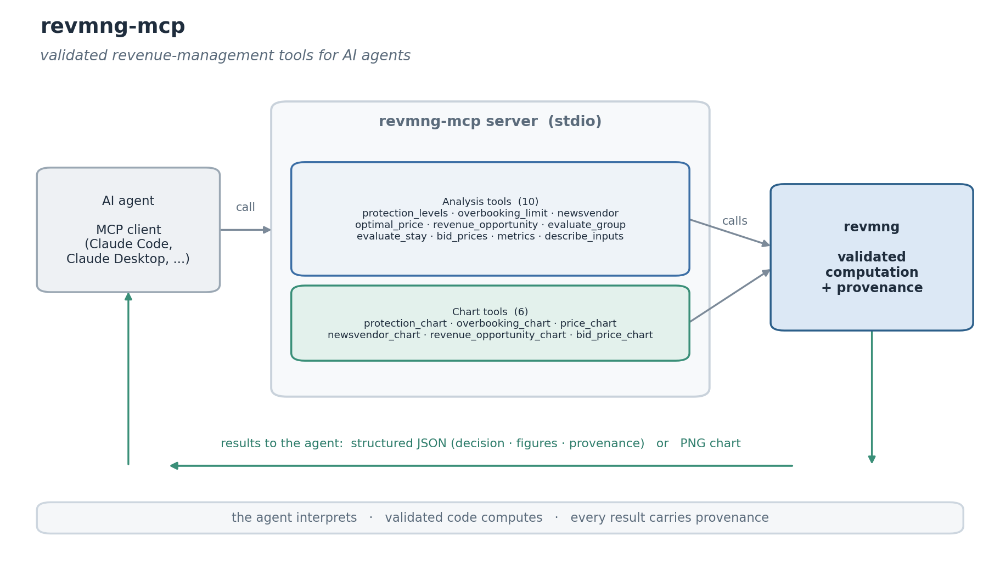

<!-- mcp-name: io.github.arikanatakan/revmng-mcp -->

# revmng-mcp

[](https://github.com/arikanatakan/revmng-mcp/actions/workflows/ci.yml)
[](https://pypi.org/project/revmng-mcp/)
[](LICENSE)

An MCP server that exposes [revmng](https://github.com/arikanatakan/revmng), the
revenue-management library for Python, as tools for AI agents: seat protection
(Littlewood, EMSR and the exact dynamic program), overbooking, pricing, group
and length-of-stay decisions, network bid prices, and ready-to-show charts.

Agents asked to set a booking limit or evaluate a group tend to do the
arithmetic themselves, and the standard methods are easy to get subtly wrong: a
protection level computed from the wrong tail, a group accepted without costing
the demand it displaces, EMSR confused with the optimum. The calculation belongs
in a deterministic, versioned, validated library that the agent calls, which
leaves the agent to choose the analysis and explain the result.



## Tools

**Analysis tools** return the library's payload: the decision, supporting
figures and provenance.

| Tool | Purpose |
| ---- | ------- |
| `protection_levels` | nested protection levels and booking limits (EMSR-b, EMSR-a or the exact optimal DP) |
| `overbooking_limit` | authorization limit, by service level or the cost trade-off |
| `newsvendor` | the critical-fractile stocking quantity |
| `optimal_price` | the profit-maximising price for a linear or constant-elasticity demand curve |
| `revenue_opportunity` | the revenue opportunity metric (ROM) against perfect and no-control benchmarks |
| `evaluate_group` | accept or reject a group by displacement analysis |
| `evaluate_stay` | accept or reject a multi-night stay against nightly bid prices |
| `bid_prices` | network bid prices from the deterministic LP |
| `metrics` | RevPAR, ADR, occupancy, yield and load factor |
| `describe_inputs` | the input fields and the method definitions |

**Chart tools** return a PNG image.

| Tool | Purpose |
| ---- | ------- |
| `protection_chart` | the nested booking limits, or the EMSR curves |
| `overbooking_chart` | the overbooking cost trade-off |
| `price_chart` | revenue, profit and demand against price |
| `newsvendor_chart` | expected profit against order quantity |
| `revenue_opportunity_chart` | perfect, no-control and realised revenue |
| `bid_price_chart` | the bid price per resource |

All tools are read-only.

## Installation

Run it with [uv](https://docs.astral.sh/uv/) (no install needed):

```
uvx revmng-mcp
```

or install from PyPI:

```
pip install revmng-mcp
```

## Configuration

Add it to your MCP client. For example:

```json
{
  "mcpServers": {
    "revmng": {
      "command": "uvx",
      "args": ["revmng-mcp"]
    }
  }
}
```

If you installed with pip, use `"command": "revmng-mcp"` with no args.

## Example

```
protection_levels(classes=[
  {"fare": 1000, "mean": 30, "sd": 12},
  {"fare": 700,  "mean": 40, "sd": 15},
  {"fare": 400,  "mean": 60, "sd": 20}
], capacity=120, method="emsr_b")
  -> { "method": "EMSR-b",
       "booking_limits_int": [120, 97, 50],
       "summary": "EMSR-b - capacity 120 ..." }
```

## Design

The server is a thin, stateless wrapper. All of the arithmetic lives in the
revmng library, which computes from the standard methods and is validated
against published worked examples (Phillips 2005) and cross-checked against an
exact dynamic program. The server adds the tool schema, read-only annotations
and an input-schema helper so an agent can format the input and act on the
result. Demand is supplied by the caller; forecasting is out of scope.

## Related

- [revmng](https://github.com/arikanatakan/revmng): the library this server wraps.

## License

MIT. Written and maintained by [Atakan Arikan](https://github.com/arikanatakan),
MSc Student at Tsinghua University and Politecnico di Milano.
